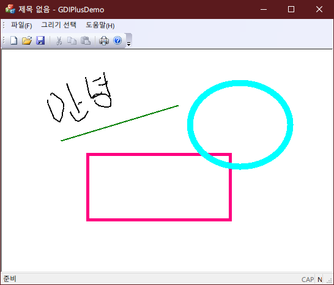

# GDI+ Demo Drawing Program
[2020-12-02] A Basic Drawing Program to Practice Some Skills for SDI and GDI+

### 프로그램 개발 환경
- Language : C++
- OS : Microsoft Windows 10
- IDE : Microsoft Visual Studio 2015 14.0

### 기능 설명
- *SDI 메뉴* 와 *GDI+* 관련 내용을 학습하기 위해 만든 프로그램
- 자유 곡선/직선/다각형/타원/사각형 그리기 가능
- 지우개 기능 추가
- 선의 두께 지정 가능
- 이미지 삽입 가능

### 실행 화면

